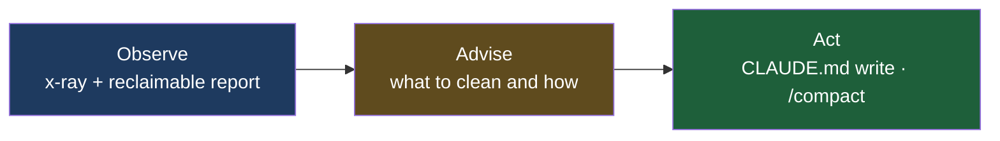
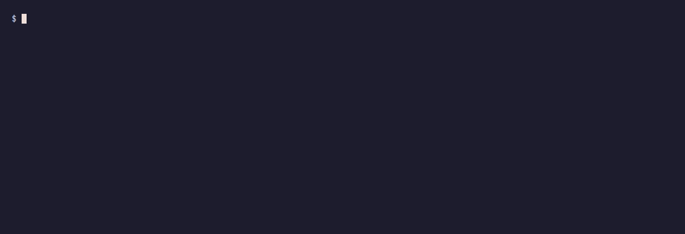
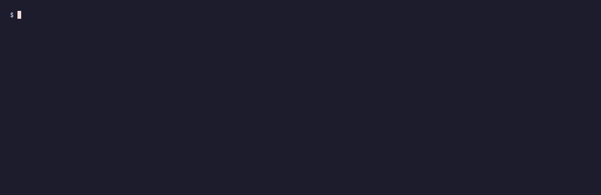
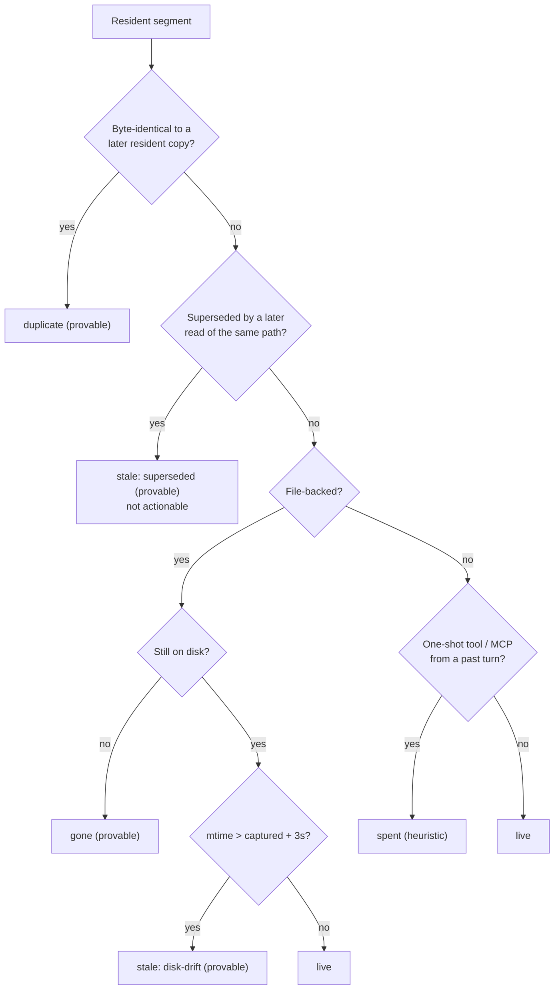
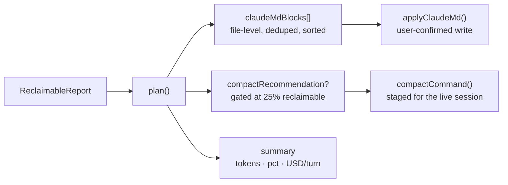
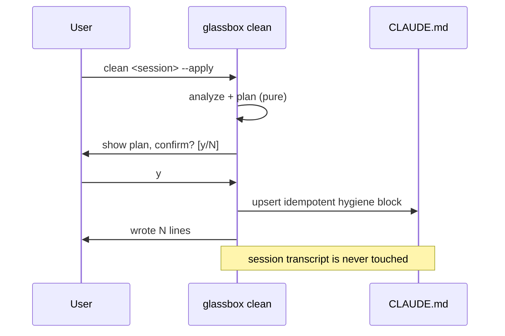
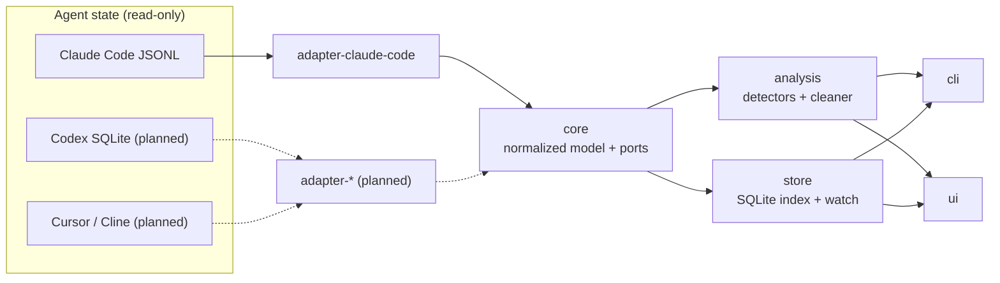
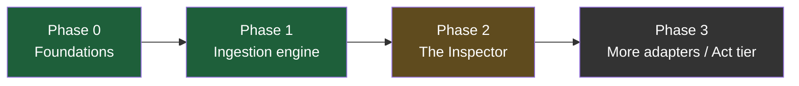

# Glassbox

**Observability for AI-agent memory and context.** A local-first, read-only
x-ray and hygiene monitor for coding agents. Glassbox reads what your agent
actually carries in its context window, tells you how much of it is garbage, what
that garbage costs you every turn, and what to do about it.

Today it works against **Claude Code** transcripts on disk. The model and
analyzers are tool-agnostic by design — Codex, Cursor, and Cline adapters are on
the roadmap.

<p align="center">
  
</p>

> The GIFs in this README are generated from reproducible [VHS](https://github.com/charmbracelet/vhs)
> tapes in [`assets/demos/`](assets/demos/). Run `./assets/demos/record-all.sh`
> to regenerate them. The terminal blocks below are representative output.

---

## Table of contents

- [The problem](#the-problem)
- [The idea](#the-idea)
- [Quickstart](#quickstart)
- [Demos](#demos)
  - [1. inspect — the full dashboard](#1-inspect--the-full-dashboard)
  - [2. xray — what is in the window](#2-xray--what-is-in-the-window)
  - [3. clean — the cleaner](#3-clean--the-cleaner)
  - [4. cost — pay only for what you think you pay for](#4-cost--pay-only-for-what-you-think-you-pay-for)
  - [5. fleet — index, sessions, watch](#5-fleet--index-sessions-watch)
  - [6. serve — the local web inspector](#6-serve--the-local-web-inspector)
- [How detection works: the reclaimable taxonomy](#how-detection-works-the-reclaimable-taxonomy)
- [How cleaning works: the hygiene pipeline](#how-cleaning-works-the-hygiene-pipeline)
- [Metrics and honesty](#metrics-and-honesty)
- [Architecture](#architecture)
- [Command reference](#command-reference)
- [Privacy and safety](#privacy-and-safety)
- [Status and roadmap](#status-and-roadmap)
- [Repository layout](#repository-layout)

---

## The problem

When you use a coding agent, its context window is a black box. You cannot see
what is resident in it, where it is stored, what it costs, or when it gets
silently summarized. So context quietly fills with **garbage** — content that
refers to something **gone, stale, or already spent** — and you pay to re-ingest
that garbage on **every single turn**, because cached context is billed at the
cache-read rate each time the agent replies.

The cost is not hypothetical. Measured on a single real Claude Code session
(`docs/20`):

| Garbage observed in one real session | Tokens |
|---|---|
| Resident content of files written then deleted/overwritten | ~70,000 |
| Spent one-shot tool outputs (Bash, Grep, MCP) still resident | ~101,000 |
| Peak context re-carried per turn | ~234,000 |

The window only grows. Same model, same task, more resident tokens — so cost per
turn climbs, and attention dilutes ("lost in the middle"). Resident tokens by
turn, garbage stacked on top of live context:

```text
resident tokens (k)
220k |                                          ####  <- garbage
     |                                 ####  ####  ##
180k |                        ####  ####  ####  ####
     |                  ##  ####  ####  ####  ####
140k |            ####  ####  ####  ####  ####  ####  <- live
     |      ####  ####  ::::  ::::  ::::  ::::  ::::
100k |  ####  ::::  ::::  ::::  ::::  ::::  ::::  ::::
     |  ::::  ::::  ::::  ::::  ::::  ::::  ::::  ::::
  60k|  ::::  ::::  ::::  ::::  ::::  ::::  ::::  ::::
     +--------------------------------------------------
        t1    t5   t10   t15   t20   t25   t30
        (::::  live context     ####  reclaimable garbage)
```

Platform built-ins (`/context`, internal memory curation) show only a **live
snapshot**. None of them flag what is garbage, measure what it costs, or work
across tools. That gap is Glassbox.

---

## The idea

Read agent state off disk (read-only), normalize it into one tool-agnostic
model, then run analyzers over that model. Three product tiers:



The headline number is **Reclaimable %** — the fraction of the resident window
that is garbage — and the dollars it wastes per turn.

---

## Quickstart

```bash
pnpm install
pnpm build

# discover Claude Code sessions on this machine
node packages/cli/dist/main.js list

# inspect the most recent one
node packages/cli/dist/main.js inspect "$(node packages/cli/dist/main.js list | head -1 | awk '{print $3}')"
```

Requires Node 22+ and pnpm. Everything runs locally; no data leaves the machine.

---

## Demos

### 1. inspect — the full dashboard

`glassbox inspect <session.jsonl>` is the single-command overview: session
metadata, the context x-ray, the cost breakdown, and the reclaimable report in
one pass.

<p align="center">
  
</p>

What every region of the output means, top to bottom:

```text
md  7aa1b77d
/home/kedar/Desktop/Projects/md
model claude-opus-4-8   started 2026-06-05 10:22:04   branch main   v2.1.163

$49.0108       216.2k tok          34%               $0.0370
SESSION COST   CONTEXT WINDOW      RECLAIMABLE       WASTED / TURN
actuals exact  428 segments        74,064 tokens     16 turns
```

- **Session cost** is computed from the provider's *actual* `usage` records, not
  an estimate. It is exact.
- **Context window** is the reconstructed resident size at the latest turn, split
  into 428 typed segments.
- **Reclaimable** is the headline: 34% of the window is garbage.
- **Wasted / turn** is what that garbage costs every turn it stays resident.

```text
-- CONTEXT X-RAY --------------------------------------------
  user          ####################   102.0k   47%
  file          #################        85.9k   40%
  assistant     ###                      16.3k    8%
  tool_result   ##                       12.0k    6%
  total  216.2k tokens  (216,194 exact)

-- COST BREAKDOWN -------------------------------------------
  $49.0108  total
  input         |                 $0.0889    0%
  output        ###               $7.6715   16%
  cache read    ##############    $34.0667  70%   <- recarry tax
  cache write   ###               $7.1837   15%
  cache saved $306.60 vs full input rate

-- RECLAIMABLE CONTEXT --------------------------------------
  34%  74.1k tokens reclaimable  ~$0.0370/turn

  GONE 0    STALE 62.6k    SPENT 10.3k    DUPLICATE 1.1k

  STATUS    TOKENS  SEGMENT
  ----------------------------------------------------------
  stale      3.6k   write parse.ts
                    older copy of .../packages/...; a later access supersedes it
  stale      3.4k   read main.ts
                    file was modified on disk after this copy was captured
  spent      1.7k   Bash result
                    one-shot Bash output from an earlier turn
```

The single most important line is **cache read 70%**: the majority of the bill
is re-ingesting context you already paid to put there, which is exactly why
reclaimable garbage is expensive.

---

### 2. xray — what is in the window

`glassbox xray <session.jsonl>` is the focused composition view: the context
window broken down by source, plus the reclaimable taxonomy. Use it when you
want to know *what kind* of content dominates the window.

<p align="center">
  
</p>

Each segment carries a `SegmentSource`, color-coded in the bar chart:

| Source | Meaning |
|---|---|
| `file` | File contents read or written into context (Read/Write/Edit) |
| `tool_result` | Non-file tool output (Bash, Grep, test runs) |
| `mcp` | MCP server tool output — envelope plus ephemeral data |
| `thinking` | Extended-thinking blocks carried in history |
| `user` / `assistant` | Conversation turns |
| `memory` | CLAUDE.md and memory-file content |

---

### 3. clean — the cleaner

This is the Advise and Act tier. `glassbox clean` turns the reclaimable report
into a concrete plan and, on confirmation, executes the safe parts of it.

<p align="center">
  
</p>

**Step 1 — dry run (default, writes nothing):**

```text
-- CLEAN PLAN ----------------------------------------------
  dry run — nothing is written. add --apply to act.

  CLAUDE.md — tell the agent which files to stop trusting:

  RE-READ    3.4k  packages/cli/src/main.ts  (provable)
                   changed on disk since last read — the resident copy is outdated
  RE-READ    3.2k  packages/ui/src/styles.css  (provable)
                   changed on disk since last read — the resident copy is outdated
  RE-READ    2.4k  packages/ui/src/components/SessionView.tsx  (provable)
                   changed on disk since last read — the resident copy is outdated
  ... (one action per drifted path, biggest token win first)

  COMPACT — window is 34% reclaimable; a compact would clear the bulk:
    spent tool/MCP output   10.3k tok
    duplicate copies         1.1k tok
    stops wasting           ~$0.0057/turn
    suggested /compact focus:
    Preserve — current task: ...; recent progress: ... .
    Drop spent tool output and old file copies.

  plan: 15 file action(s) + 1 compact  .  74.1k tok reclaimable  .  ~$0.0370/turn
```

> When a file has been **deleted** (not just changed), the action is `STOP`
> instead of `RE-READ` — "deleted; do not read or reference it." This session
> happens to have drifted-but-present files, so every action is a `RE-READ`.

**Step 2 — apply (writes CLAUDE.md, user-confirmed):**

```text
$ glassbox clean <session> --apply
  Target: /home/kedar/Desktop/Projects/md/CLAUDE.md
  appends/updates a managed Glassbox block; your content is untouched
  Write 15 hygiene line(s) to CLAUDE.md? [y/N] y
  wrote hygiene block to /home/kedar/Desktop/Projects/md/CLAUDE.md
```

The written block is bounded by idempotent markers, so re-running replaces it in
place rather than stacking duplicates:

```markdown
<!-- glassbox:hygiene:start -->
## Context hygiene — Glassbox 2026-06-06T14:31:02Z
These files drifted from or left the workspace after they entered context.

**Deleted — do not read or reference:**
- `src/old-auth.ts` — deleted; do not read or reference it.

**Changed on disk — re-read before relying on the cached copy:**
- `docs/spec.md` — changed on disk; re-read it before relying on the cached copy.
<!-- glassbox:hygiene:end -->
```

**Step 3 — compact (stages the command, never runs it):**

```text
$ glassbox clean <session> --compact
-- COMPACT COMMAND -----------------------------------------
  run this inside your live Claude Code session:

  /compact Preserve — current task: wire the cleaner into the CLI; recent
  progress: added renderCleanPlan. Drop spent tool output and old file copies.

  copied to clipboard
  Glassbox never compacts for you; it can't mutate a session. This just stages the command.
```

`--json` emits the full `CleanPlan` for scripting or the UI. The intervention
mapping is covered in [the hygiene pipeline](#how-cleaning-works-the-hygiene-pipeline).

---

### 4. cost — pay only for what you think you pay for

`glassbox cost <session.jsonl>` shows the cost breakdown from the provider's
actual usage records, with cache-read (the recarry tax) broken out separately.

<p align="center">
  
</p>

Cost is **exact**, not estimated: it multiplies the captured `usage` numbers by
authoritative per-model pricing. Cache-read is highlighted because it is the
recurring cost of carrying context turn after turn.

---

### 5. fleet — index, sessions, watch

For monitoring everything over time, Glassbox indexes parsed sessions into a
local SQLite database and can keep it live.

<p align="center">
  
</p>

```text
$ glassbox index
indexed: scanned 610, parsed 12, unchanged 598, removed 0, failed 0  (610 total)

$ glassbox sessions --limit 5
-- SESSIONS ------------------------------------------------
  PROJECT       DATE / TIME           MSG  TOOL  MEM  ID
  ----------------------------------------------------------
  md            2026-06-06 14:22:07   777   214    3  3f9c1a2b
  md            2026-06-06 11:05:41    88    19    0  a1b2c3d4
  ...
  5 sessions . local index
```

Indexing is incremental on `(mtime, size)` — re-indexing 610 real sessions
re-parses only what changed (about 1.5s cold, 0.08s warm). `glassbox watch`
keeps the index live via recursive file watching.

---

### 6. serve — the local web inspector

`glassbox` (or `glassbox serve`) indexes your sessions and launches a local,
read-only web dashboard on `127.0.0.1`.

<p align="center">
  
</p>

```text
$ glassbox
indexed: scanned 610, parsed 12, unchanged 598  (610 total)
Glassbox inspector: http://127.0.0.1:4317
local-only, read-only. Press Ctrl-C to stop.
```

The web UI renders the same engine outputs as the CLI: reclaimable report,
context x-ray, cost attribution, session navigation, and explicit
compaction-status limitations.

---

## How detection works: the reclaimable taxonomy

Detection classifies each resident segment against a strict precedence
(most-specific first). Three of the four classes are **provable** from the model
plus the filesystem; `spent` is a conservative, clearly-labeled heuristic.



| Status | Signal | Confidence | Cleaner action |
|---|---|---|---|
| `gone` | file deleted on disk (`modifiedAt` is null) | provable | CLAUDE.md: stop referencing |
| `stale` (disk-drift) | `modifiedAt > capturedMs + 3s` | provable | CLAUDE.md: re-read |
| `stale` (superseded) | later read of same path in-session | provable | none (agent already has newer copy) |
| `duplicate` | identical content hash to a later copy | provable | compact |
| `spent` (tool) | one-shot tool, not in last turn | heuristic | compact |
| `spent` (MCP) | `source = mcp`, not in last turn | heuristic | compact |

The reclaimable dollars-per-turn use the **cache-read** rate, because reclaimable
context is re-ingested from cache every turn:

```
wastedUsdPerTurn = (reclaimableTokens / 1,000,000) * cacheReadPricePerMTok
```

---

## How cleaning works: the hygiene pipeline

Detection answers *which segments are garbage*. The cleaner answers *what to do
about them*, splitting interventions by garbage shape:

- **File-specific garbage** (`gone`, `stale-drift`) is fixed by a durable
  **CLAUDE.md** edit — the memory write the agent would make itself.
- **Accumulated non-file garbage** (`spent`, `duplicate`) is cleared by a
  threshold-gated **compact** recommendation.



The write path is always user-confirmed, and the compact is only ever staged for
you to paste — Glassbox never mutates a running session:



---

## Metrics and honesty

Glassbox is built to be trusted with money decisions, so it is explicit about
what is exact and what is estimated.

| Quantity | Source | Accuracy |
|---|---|---|
| Session cost | provider `usage` actuals x per-model pricing | exact |
| Reclaimable: `gone` / `stale` / `duplicate` | model + filesystem | provable |
| Reclaimable: `spent` | one-shot tool list / MCP source tag | heuristic, labeled |
| Segment token sizes (text) | local 4-chars/token estimate | ~0.86x vs provider truth |
| File / tool segment sizes | adapter-recorded counts | exact |

There is no accurate local Claude tokenizer (the only exact count is a network
endpoint, which local-first forbids by default), so text sizing stays an estimate
behind a swappable `TokenCounter` seam, and `token-accuracy.ts` characterizes its
error against provider truth so x-ray sizes carry an honest error bar. File and
tool segment sizes use the adapter's exact counts and are not estimated.

---

## Architecture

The moat is the **adapter layer plus the normalized model**, not the UI.
Everything is built inside-out: data layer, then analysis, then surfaces. The
dependency arrow only ever points toward `core`.



| Package | Role | Depends on |
|---|---|---|
| `@glassbox/core` | Normalized model + `Adapter` / `TokenCounter` / `RepoState` contracts. Zero runtime deps. | — |
| `@glassbox/adapter-claude-code` | Reads `~/.claude/projects/**/*.jsonl` into the model. | core |
| `@glassbox/analysis` | Detectors and the cleaner: reclaimable, cost, token-accuracy, plan. | core |
| `@glassbox/store` | Local SQLite index (`node:sqlite`, no native build) with incremental + watch. | core |
| `@glassbox/cli` | The `glassbox` command. | core, adapter, analysis, store |
| `@glassbox/ui` | Local web inspector. | (served by cli) |

The full engineering map is in [`ARCHITECTURE.md`](ARCHITECTURE.md); the design
decisions are recorded in [`docs/adr/`](docs/adr/).

---

## Command reference

| Command | What it does |
|---|---|
| `glassbox` | Index sessions and launch the local web inspector |
| `glassbox serve [--port n]` | Launch the web inspector (default port 4317) |
| `glassbox inspect <session>` | Full dashboard: stats + x-ray + cost + reclaimable |
| `glassbox xray <session>` | Context composition by source + reclaimable tokens |
| `glassbox cost <session>` | Cost breakdown from provider actuals |
| `glassbox clean <session>` | Hygiene plan; `--apply` writes CLAUDE.md, `--compact` stages /compact, `--json` emits the plan |
| `glassbox sessions [--project p]` | List indexed sessions (fast, no re-parse) |
| `glassbox index [--project p]` | Parse and incrementally index sessions into SQLite |
| `glassbox watch [--project p]` | Index, then keep it live on file changes |
| `glassbox list [--project p]` | Discover Claude Code sessions on disk |
| `glassbox parse <session>` | Dump the full normalized model as JSON |

`index` / `sessions` / `watch` accept `--db <path>` (default `~/.glassbox/index.db`).

---

## Privacy and safety

- **Local-first.** Everything runs on your machine; the web inspector binds
  `127.0.0.1`. No session data is sent anywhere.
- **Read-only on your data.** Glassbox never modifies session transcripts and
  never patches a running agent. The only write path is the user-confirmed
  CLAUDE.md hygiene block.
- **Confirmed actions only.** Every write-side action is gated behind explicit
  confirmation or `--yes`. The compact is only ever staged for you to paste.
- **Degrades gracefully.** Unknown shapes produce warnings and partial results,
  never a crash.

---

## Status and roadmap



- **Phase 0 (Foundations) — complete.** Workspace, normalized model, adapter and
  port contracts, working discovery, reclaimable-analyzer shape.
- **Phase 1 (Ingestion engine) — complete.** Claude Code adapter (JSONL to
  model, verified on 777-message / 2.5 MB transcripts), exact cost from actuals,
  context reconstruction, the full reclaimable taxonomy, and the SQLite
  index/watch.
- **Phase 2 (The Inspector) — in progress.** Local API server over the index and
  a Vite/React dashboard. Remaining: deeper UI dogfooding, broader edge-case
  fixtures, a true compaction diff once a compacted transcript schema is observed,
  and the Phase-E hygiene panel (one-click apply in the UI).
- **Next.** Additional adapters (Codex, Cursor, Cline), relevance-ranked eviction
  beyond absolute garbage, and the Act tier (an MCP proxy that strips garbage
  before it enters context). An exploratory mem0 memory-hygiene spike lives in
  [`spikes/mem0-hygiene/`](spikes/mem0-hygiene/).

---

## Repository layout

```
.
├── README.md             you are here
├── ARCHITECTURE.md       engineering map
├── packages/
│   ├── core/             normalized model + contracts (the spine)
│   ├── adapter-claude-code/  Claude Code JSONL -> model
│   ├── analysis/         detectors + cleaner
│   ├── store/            SQLite index + watch
│   ├── cli/              the glassbox command
│   └── ui/               local web inspector
├── spikes/
│   └── mem0-hygiene/     evidence spike: does mem0 accumulate garbage?
├── assets/demos/         VHS tapes that generate the README GIFs
└── docs/                 product research (market, taxonomy, cleaner design, ...)
```

Key reading: the garbage taxonomy ([`docs/20`](docs/20-context-garbage-evidence-and-taxonomy.md)),
the cleaner design ([`docs/21`](docs/21-context-cleaner-design.md)), and the
phased plan ([`docs/17`](docs/17-phased-execution-plan.md)).

---

Local-first. Read-only. Built inside-out.
