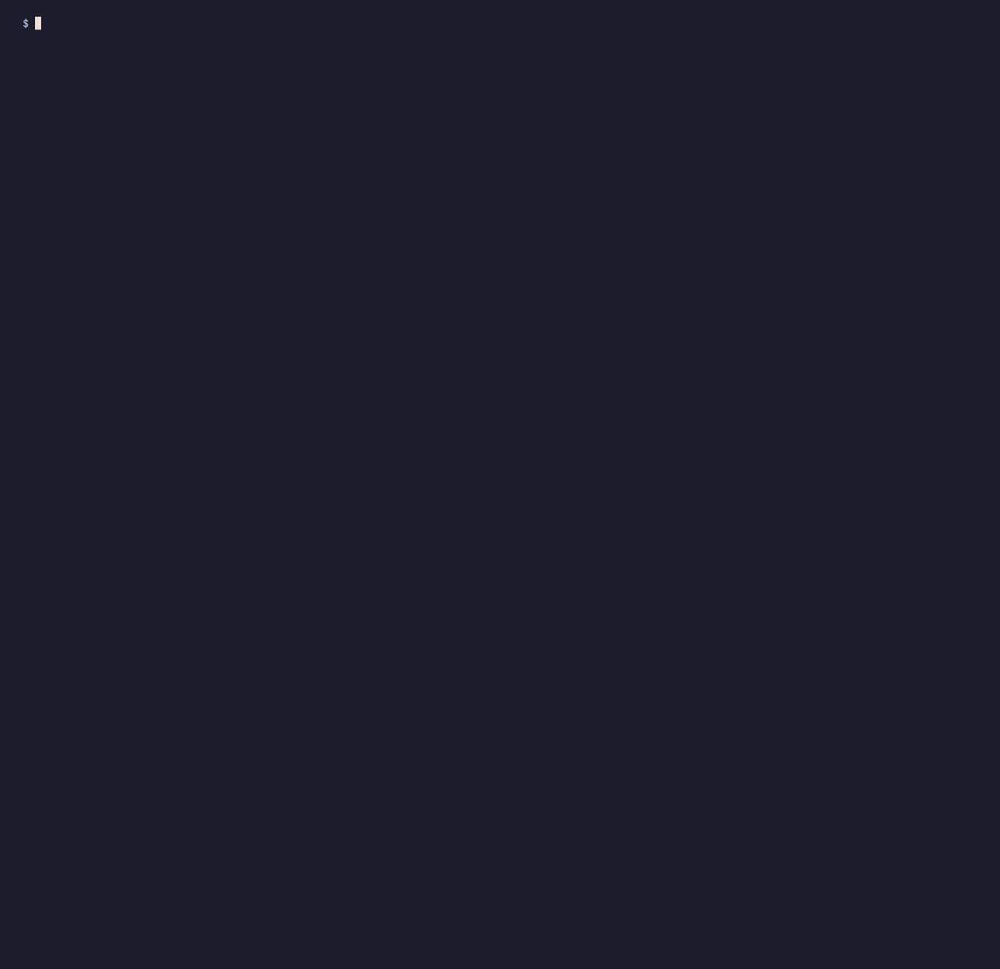
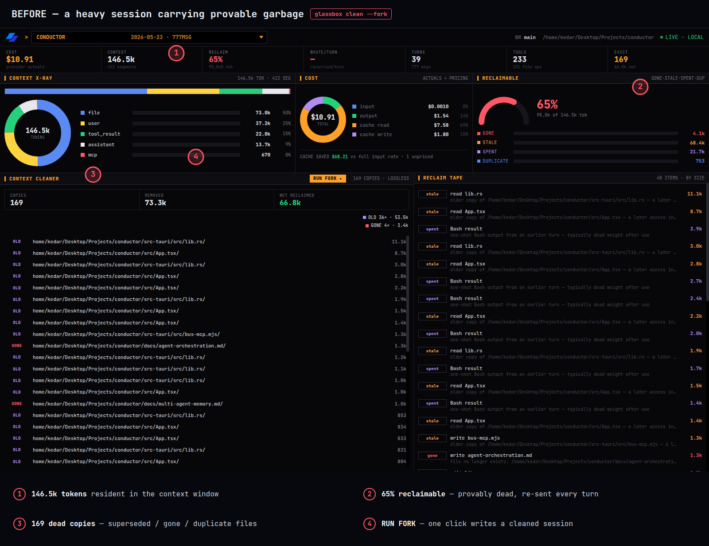
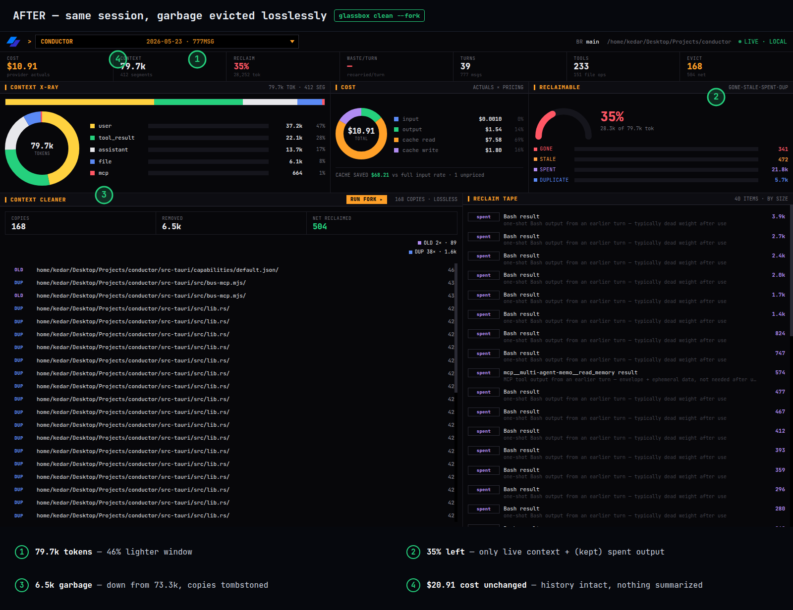

<div align="center">
  <h1>Glassbox</h1>
  <p>
    <span style="background: #007AFF; color: white; padding: 6px 12px; border-radius: 16px; margin: 4px; display: inline-block; font-size: 13px; font-weight: 600;">Local-first</span>
    <span style="background: #312ECB; color: white; padding: 6px 12px; border-radius: 16px; margin: 4px; display: inline-block; font-size: 13px; font-weight: 600;">Read-only</span>
    <span style="background: #34C759; color: white; padding: 6px 12px; border-radius: 16px; margin: 4px; display: inline-block; font-size: 13px; font-weight: 600;">Lossless Fork</span>
    <span style="background: #FF9500; color: white; padding: 6px 12px; border-radius: 16px; margin: 4px; display: inline-block; font-size: 13px; font-weight: 600;">Web Inspector</span>
  </p>
</div>

Glassbox is a local-first, read-only inspector for AI-agent context. It reads what
a coding agent actually carries in its context window, shows how much of it is
garbage and what that garbage costs every turn, and removes the garbage losslessly
by writing a cleaned copy of the session you can resume from.

It works today against Claude Code transcripts on disk. The model and analyzers
are tool-neutral, so other adapters can be added without changing them.

<p align="center">
  
</p>

## The problem

An agent's context window is a black box. You cannot see what is resident, where it
came from, or what it costs. Over a long session the window fills with content that
refers to something gone, stale, or already spent, and you pay to re-ingest it on
every turn, because cached context is billed at the cache-read rate on each reply.

Across 57 real Claude Code sessions (each at least 150 KB), 59.5% of all resident
context tokens were provably reclaimable garbage.

## How it works

Glassbox parses a transcript, reconstructs what is resident in the window, and
classifies every segment. It removes only garbage it can prove is dead:

- `gone` — file content whose file was deleted.
- `stale-drift` — a copy outdated because the file changed on disk.
- `stale-superseded` — an older copy a later read of the same file replaced.
- `duplicate` — a byte-identical repeat of resident content.

Removal is a fork, not a rewrite. Glassbox writes a new copy of the transcript with
that garbage replaced by short tombstones, leaving every message and tool-call pair
intact, and refuses to write a copy that would not load. Your original session is
never modified. This is lossless: nothing the model still needs is touched, so it
avoids the accuracy loss that summarizing compaction causes.

## Metrics

Measured across 57 Claude Code sessions of at least 150 KB, 2.3M context tokens
total:

| Metric                    | Value                                      |
| ------------------------- | ------------------------------------------ |
| Provably reclaimable      | 1.37M tokens (59.5% of context)            |
| Net reclaimed by the fork | 1.29M tokens (55.9%, after tombstone cost) |
| Copies tombstoned         | 2,051                                      |

One real session, end to end:

```
$ glassbox clean <session.jsonl> --fork
tombstoned 169 copies; 66,788 tokens net reclaimed
context tokens  146.5k -> 79.7k  (46% lighter)
```

Cost figures use provider-reported token counts and are exact. Segment sizes use a
local estimate (about four characters per token) shown with an error bar.

## Quickstart

**Requires Node 22+.** One command installs everything and puts `glassbox` on your PATH:

```bash
curl -fsSL https://raw.githubusercontent.com/kedarvartak/glassbox/main/install.sh | bash
```

Or, if you have already cloned the repo:

```bash
./install.sh
```

Then:

```
glassbox list                              # find sessions on disk
glassbox clean <session.jsonl>             # dry run: see the plan
glassbox clean <session.jsonl> --fork      # write a cleaned session
```

Resume the cleaned session:

```
cd <your project dir>
claude --resume     # pick the newest session
```

<details>
<summary>Manual install (pnpm)</summary>

```
pnpm install
pnpm build
printf '#!/usr/bin/env bash\nexec node %s/packages/cli/dist/main.js "$@"\n' "$PWD" \
  > ~/.local/bin/glassbox && chmod +x ~/.local/bin/glassbox
```

</details>

<p align="center">
  
</p>

## The web inspector

```
glassbox serve     # local dashboard at 127.0.0.1:4317
```

Open a session to read its x-ray and cost, and click RUN FORK in the Context
Cleaner panel to write a cleaned session from the browser. The dashboard then
switches to the cleaned session so you can see the result.

The example below is one real session before and after a fork. The window drops
from 146.5k to 79.7k tokens (46% lighter) and reclaimable falls from 65% to 35%,
while cost and history stay exactly the same — nothing was summarized.

<p align="center">
  
</p>
<p align="center">
  
</p>

## Commands

| Command                       | What it does                                        |
| ----------------------------- | --------------------------------------------------- |
| `glassbox serve`              | index sessions and open the web inspector           |
| `glassbox inspect <s>`        | full dashboard: stats, x-ray, cost, reclaimable     |
| `glassbox xray <s>`           | window composition by source and reclaimable tokens |
| `glassbox cost <s>`           | cost breakdown from provider actuals                |
| `glassbox clean <s> [--fork]` | eviction plan; `--fork` writes a cleaned session    |
| `glassbox sessions`           | list indexed sessions                               |
| `glassbox index` / `watch`    | build or live-update the index                      |
| `glassbox list` / `parse <s>` | discover sessions; dump the parsed model            |

## Safety

Glassbox is local-first and bound to 127.0.0.1. It never modifies your
transcripts: the only thing it writes is a new sibling session, and it validates
that the cleaned copy preserves every structural invariant before writing one.

## Documentation

- [docs/idea.md](docs/idea.md) — the problem and the approach.
- [docs/architecture.md](docs/architecture.md) — packages, pipeline, and the fork.
- [docs/usage.md](docs/usage.md) — full command and workflow reference.

## Repository layout

```
packages/core               tool-neutral model
packages/adapter-claude-code parse, fork, validate Claude Code transcripts
packages/analysis           detection, eviction planning, cost
packages/store              SQLite session index
packages/cli                glassbox command and web server
packages/ui                 React dashboard
```
