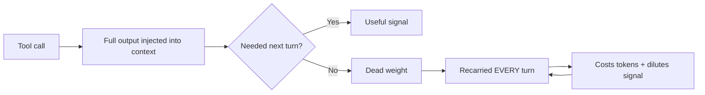
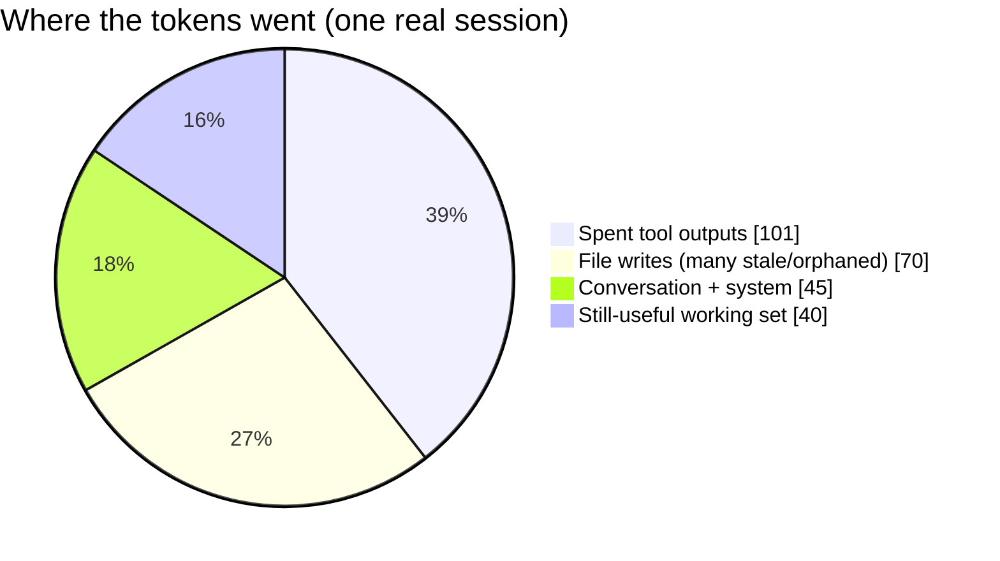
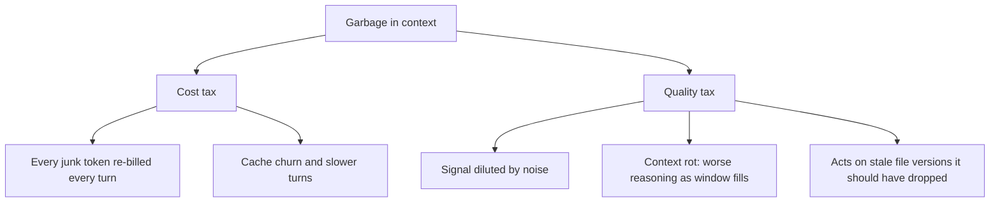

# Context Rot: Why Your Claude Code Sessions Quietly Fill With Garbage

*Your agent isn't dumb. Its context window is just full of trash.*

---

If you've used Claude Code for anything longer than a quick fix, you've felt it: the session starts sharp, then slowly turns sluggish, expensive, and forgetful. It re-reads files it already knows. It "forgets" a decision you made twenty minutes ago. Your token bill creeps up for no obvious reason.

The usual explanation is "long sessions are hard." That's true but incomplete. The real culprit is more concrete and more fixable: **the context window steadily fills with garbage** — content that mattered for one turn and then became dead weight, recarried on every single turn until the session ends.

This post is about what that garbage actually *is*, measured from a real session, and why it quietly taxes both your wallet and your agent's intelligence.

---

## What "context" actually holds

On every turn, the model re-reads everything in the window: the system prompt, tool definitions, your conversation, and — the big one — **the full output of every tool the agent has run.** Read a file? Its entire contents are now in context. Run a build? The whole log is in context. Call an MCP tool? The URL, the envelope, the schema, and the raw result are all in context.

None of it leaves on its own.



The window has a fixed budget. Every token of garbage is a token that can't be useful work — and a token you pay for, again, every turn it lingers.

---

## What I measured in one real session

I pulled apart a single, ordinary Claude Code working session (the kind where you're editing docs and running commands) straight from its on-disk transcript. Rough numbers, ~4 chars/token:

| Measurement | Value | What it means |
|---|---|---|
| Tool-result payload accumulated | **~101,000 tokens** | results that mostly mattered for one turn |
| File-write content pushed into context | **~70,000 tokens** | full file bodies, many later changed or deleted |
| Peak context recarried in a single turn | **~234,900 tokens** | what the model re-ingests *every* turn |
| Largest single resident blob | **~12,700 tokens** | one command output, just sitting there |

Let that second-to-last row sink in. At the peak, nearly **a quarter of a million tokens** were being re-read on every turn — and this was a *normal* session, with no giant codebase dumps and **not a single MCP tool involved.**

---

## The four kinds of garbage

### 1. Orphaned and duplicate file content

This is the worst offender, and the most embarrassing once you see it.

Every time the agent writes or edits a file, the **full new content** goes into context. The **old version never leaves.** In my session:

| File | Times rewritten | Copies now in context |
|---|---|---|
| `README.md` | 4× | 4 (3 obsolete) |
| `index.ts` | 4× | 4 (3 obsolete) |
| a planning doc | 3× | 3 (2 obsolete) |
| ~10 other docs | 2× each | 2 each |

It gets worse. Midway through, the session **deleted ~18 files** with `rm -rf` and created new ones. Those deleted files? **Their full contents are still in the context window** — the model is faithfully re-reading, every turn, documents that *no longer exist on disk.*

That's ~70,000 tokens of file content, a large chunk of it describing a reality that's already gone.

### 2. Spent one-shot tool outputs

You run `ls -la` to check something. You read a 500-line log to find one error. You dump a big file to grab a function. Useful — for one turn. After that, it's ballast. In my session the largest resident blobs (~12.7k, ~4.8k, ~3.3k tokens…) were exactly these: command and tool outputs that were consumed once and then recarried forever. **~101,000 tokens** of tool results, most of them already spent.

### 3. MCP envelope cruft

When an MCP tool is called, the context doesn't just get the *answer* — it gets the full URL, the request/response envelope, IDs, and often the tool/resource **schemas re-injected repeatedly.** The content was the point; the wrapper is noise. (My measured session had no MCP calls, so I can't put a number on it here — but if you live in MCP servers, this stacks *on top of* everything above.)

### 4. Bonus: the logs are mostly noise too

This isn't context-window garbage, but it rhymes. Poke at an agent's own debug store and you'll often find hundreds of megabytes dominated by telemetry and transport chatter — OpenTelemetry spans, websocket pings, internal log lines — with the actually-meaningful events buried in the noise. Raw agent logs are not the same as signal.

---

## A picture of a polluted window

Relative composition of that single session's resident context:



The depressing part: a big slice of that pie is **reclaimable** — deleted files, overwritten versions, one-shot outputs — and it's being paid for on every turn.

And here's the shape of the tax over a session — tokens recarried per turn climbing as junk accumulates:

```mermaid
xychart-beta
    title "Context recarried per turn (illustrative, from observed growth)"
    x-axis ["early", "", "", "mid", "", "", "late", "peak"]
    y-axis "Tokens recarried" 0 --> 250000
    line [20000, 60000, 95000, 140000, 175000, 200000, 220000, 235000]
```

---

## Why it actually hurts

There are two costs, and the second is sneakier than the first.



**The cost tax** is obvious: tokens are money, and garbage tokens are billed turn after turn. A 35%-polluted window is roughly a 35% surcharge on every message.

**The quality tax** is the one that bites silently. Models don't reason equally well across a packed window — as it fills with stale and irrelevant content, the useful signal gets diluted and the agent's answers degrade. This is what people mean by **"context rot."** Worse, when the window still holds the *old* version of a file you've since rewritten or deleted, the agent can confidently act on a reality that no longer exists.

| Symptom you've felt | Likely garbage cause |
|---|---|
| "Why is this session so expensive now?" | spent tool outputs + recarried file bodies |
| "It re-read a file it already had." | the cached copy was buried/stale |
| "It used an old version of my code." | orphaned/overwritten file content still resident |
| "It got dumber as we went." | context rot from a diluted window |
| "It forgot what we decided." | useful signal crowded out by noise |

---

## What you can do today

No magic required — just hygiene:

- **Start fresh more often.** When a task is done, a clean session beats dragging a landfill into the next problem. `/clear` is underrated.
- **Watch the window.** `/context` shows you what's actually occupying space — check it when things feel slow.
- **Compact deliberately,** not just when forced. Summaries are lossy; know what you're trading.
- **Be stingy with tool output.** Prefer targeted reads over dumping whole files; grep before you cat.
- **Trim your MCP surface.** Disable tools/servers you aren't using this session — their schemas ride along on every turn.
- **Don't rewrite the same file ten times in one session** if you can avoid it; each rewrite leaves its ghost behind.

---

## The takeaway

Long agent sessions don't degrade because the model gets tired. They degrade because the context window is an **append-mostly log** that nobody empties — and tool outputs, file rewrites, deleted-file ghosts, and MCP envelopes pile up until you're paying a premium for a window stuffed with content that refers to something **gone, stale, or already spent.**

The good news: almost all of it is *identifiable*. Deleted files are deleted. Overwritten versions are superseded. One-shot outputs are never referenced again. Once you start seeing your context as something with a budget worth defending, the sluggish, forgetful, expensive late-session slump stops feeling mysterious — and starts feeling fixable.

Your agent is only as sharp as the window you let it work in. Take out the trash.
