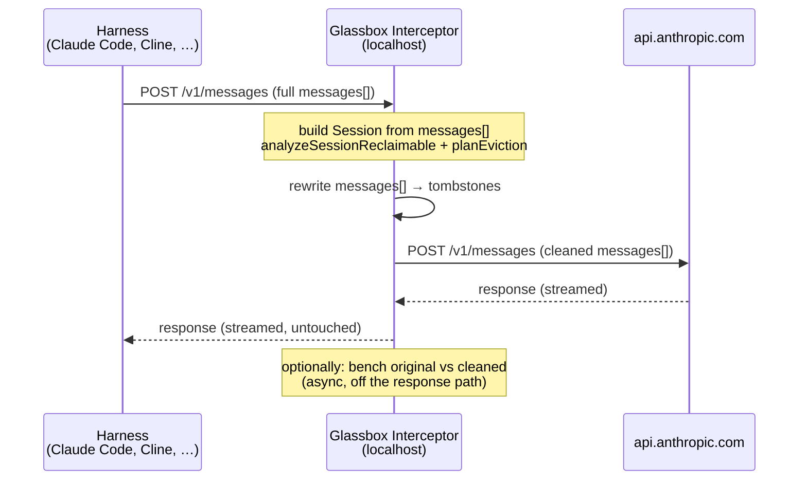
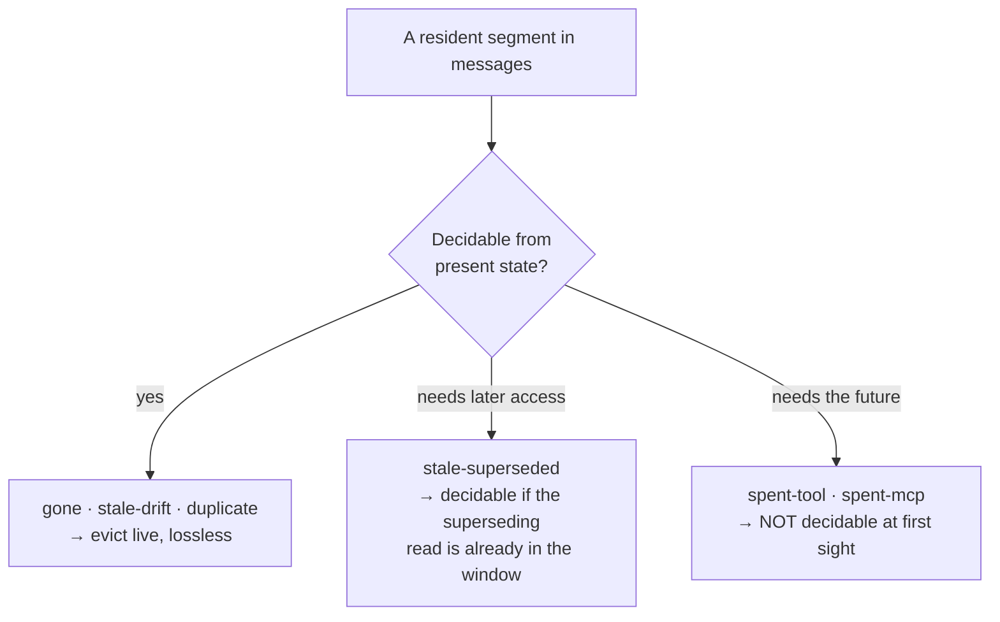

# The Interceptor — a harness-agnostic, live context cleaner

**Status:** design / not yet implemented
**Supersedes:** the per-harness adapter roadmap as the primary cross-tool strategy

---

## Why this exists

Glassbox today reads a finished transcript off disk, parses the harness's native
format into the neutral `Session` model, finds the provable garbage, and writes a
cleaned fork. That works, but it makes cross-tool support an integration
treadmill: every agent (Claude Code, Cline, Cursor, Codex, any SDK app) stores
its session differently, and some don't persist a usable transcript at all. One
adapter per harness is linear work for a product that wants to be universal — and
worse, it's all _retroactive_: you only reclaim garbage _after_ you've already
paid to send it.

There is one thing every harness does identically, regardless of how it stores
state internally: **it sends an Anthropic Messages API request.** That request's
`messages[]` array _is_ the context window. If Glassbox sits between the harness
and the API, it sees the exact bytes about to be billed — for every tool, with
zero per-harness integration.

The interceptor is that seam: a local proxy that intercepts each request, runs
the existing reclaimable analysis on the live `messages[]`, surgically removes
the garbage, and forwards the smaller request to the real API. The harness never
knows.

---

## The core insight

The retroactive design treats a session as a **file** — a complete past to
analyze. The interceptor treats it as a **stream** — a growing present to filter.

This reframing is the whole idea, and it changes what's hard:

- **Provable garbage is stateless.** `gone`, `stale-drift`, and `duplicate` are
  functions of the current request plus the current filesystem. They port to the
  live setting for free — and are actually a _stronger_ signal live, because the
  proxy stats the real disk at the exact moment of the call rather than
  reconstructing disk state after the fact.
- **Heuristic garbage (`spent`) secretly relied on having the whole transcript.**
  "Never referenced _again_" is a claim about the future, which a live proxy does
  not have. This is the one genuinely new problem the interceptor must solve
  (see [Live analysis](#live-analysis-present-state-vs-the-future)).

---

## Architecture at a glance



The user opts in with a single environment variable the Anthropic SDK already
honors:

```bash
ANTHROPIC_BASE_URL=http://localhost:4099
```

Because every harness builds on that SDK (or speaks the same HTTP contract),
pointing `ANTHROPIC_BASE_URL` at the proxy works everywhere — no adapter, no file
parsing, no harness-specific code.

---

## What we reuse vs. what's new

The analysis core was deliberately built tool-neutral and pure, so most of it
moves over unchanged.

**Reused as-is** (all in `packages/analysis` and `packages/core`):

- `analyzeSessionReclaimable(session, { repo, tokens })` — classifies every
  resident segment into `gone` / `stale` / `spent` / `duplicate`.
- `planEviction(report, snapshot, opts)` — turns the report into an
  `EvictionPlan` of surgical `EvictAction`s with tombstones.
- `reconstructContext(session, { tokens })` — builds the `ContextSnapshot` the
  planner joins against.
- `PROVABLE_CLASSES` / `TIER1_CLASSES` / `ReclaimableDetail` — the same taxonomy.
- The `RepoState` port (`exists` / `read` / `modifiedAt`) — the proxy supplies a
  filesystem-backed implementation, exactly like the CLI does.

**New, and small:**

1. A **`messages[] → Session` builder** — the in-memory analogue of
   `parseClaudeSession`. This is the one substantial new component.
2. A **request rewriter** — applies an `EvictionPlan` to the live `messages[]`
   objects (instead of `forkTranscript` rewriting JSONL text).
3. The **proxy server** itself — TLS/HTTP plumbing, streaming pass-through,
   request/response lifecycle.

Everything downstream of the `Session` boundary is shared with the CLI, so the
two surfaces agree on what "garbage" means by construction.

---

## The messages[] → Session builder

The analyzers consume a `Session`: messages, `toolCalls` (with stitched
inputs+outputs), `fileOps` (Read/Write/Edit lifted with paths and content
hashes), and turns. `parseClaudeSession` produces all of that from Claude Code's
JSONL. The proxy needs the same `Session`, but from the API request body.

The good news: an Anthropic request body carries everything the analyzers need.

| `Session` field needs | Source in `messages[]`                                                        |
| --------------------- | ----------------------------------------------------------------------------- |
| `messages`            | the array itself (`role` + `content[]`)                                       |
| `toolCalls` (inputs)  | `tool_use` blocks in assistant messages                                       |
| `toolCalls` (outputs) | `tool_result` blocks in the following user message                            |
| `fileOps`             | `tool_use` blocks whose `name` is `Read`/`Write`/`Edit` + their paired result |
| content hashes        | hash the `tool_result.content` / `tool_use.input` at build time               |

The builder walks `messages[]`, stitches each `tool_use` to its matching
`tool_result` by `tool_use_id` (the API guarantees the pairing), lifts file
operations by tool name, and emits the neutral model. It is the mirror image of
the existing parser — same output shape, different input — so the analysis layer
cannot tell which one produced the `Session`.

> **Note on `system` and `tools`.** The request also carries the system prompt and
> tool _definitions_, which occupy real window space (`SegmentSource` already has
> `system` and `tools`). The interceptor sees these directly — better than the
> on-disk path, where they're often implicit — so the x-ray is more complete live.

---

## Live analysis: present-state vs. the future

This is the part that does not port for free. The reclaimable classes split on a
single axis — **can this be decided from the present alone?**



| Class                      | Live? | Why                                                                              |
| -------------------------- | ----- | -------------------------------------------------------------------------------- |
| `gone`                     | ✅    | `repo.exists(path)` — pure present check                                         |
| `stale-drift`              | ✅    | `repo.modifiedAt(path)` vs. capture time — present check                         |
| `duplicate`                | ✅    | byte-compare two resident copies — present check                                 |
| `stale-superseded`         | ⚠️    | needs a _later_ read of the same path; present iff that read is already resident |
| `spent-tool` / `spent-mcp` | ❌    | "never referenced _again_" is a statement about future turns                     |

The provable classes (`gone`, `stale-drift`, `duplicate`) are exactly the lossless
default (`PROVABLE_CLASSES`) and work perfectly live. `stale-superseded` works
whenever the newer read is already in the window — which, for cleaning purposes,
is the only case that matters: if the superseding read isn't resident yet, the
older copy isn't redundant yet either.

`spent` is the real gap, and it's the largest reclaimable mass in most sessions.

### Recovering `spent` without seeing the future

Three options, increasing in cleverness:

1. **Lossless-only mode.** Evict only the provable classes live. Zero risk, no
   model call, and — given the 59.5% provable-garbage figure from the corpus —
   likely a shippable product on its own: real-time provable cleaning across any
   harness.

2. **Lookback window.** Don't treat a tool output as spent until it's gone N
   turns _without_ being referenced in those turns. This doesn't predict the
   future; it waits for enough past to accumulate. "Never again" becomes "not in
   the last N turns," which _is_ decidable now.

3. **Resident reference-graph (the interesting one).** Every request hands you the
   _entire current window_. So "spent" can be reframed from "never referenced
   again" to **"nothing _still resident_ depends on this block."** That is exactly
   the data in `messages[]` at call time, and it's the right question anyway:
   anything already evicted from the window can't reference the block, so the only
   dependents that matter are the ones currently present. The proxy's view and the
   context window are the same object — which is what makes this tractable live.

A sensible default: run lossless-only from the first call, and layer in the
resident reference-graph for `spent` once the window crosses a token threshold
(spend only matters once the window is big).

---

## Rewriting the request

`forkTranscript` rewrites JSONL _text_ and never deletes a block — the API
requires every `tool_use` to keep its matching `tool_result`, so deletion would
orphan pairs and break the request. The interceptor follows the same rule, but
operates on the in-memory `content[]` objects instead of file bytes:

- a Read's bytes live in `tool_result.content` (and a mirrored `toolUseResult`) →
  replace with the tombstone string, keep the block and its `tool_use_id`.
- a Write/Edit's bytes live in `tool_use.input` (`content` / `new_string` /
  `edits[]`) → stub those fields, keep the block.
- blocks with nothing to evict pass through untouched.

The tombstone text is the same product surface as the fork
(`renderTombstone`) — a short marker that tells the model the content was removed
by tooling and where the current version is, so it neither re-reads needlessly nor
treats the gap as an error.

Because the rewrite preserves every `tool_use`/`tool_result` pair and every
message, the request stays valid by construction. We can still run the existing
`validateTranscript` invariant set against a serialized view as a belt-and-braces
gate before forwarding.

---

## The bench, inline

The compaction bench ([compaction-bench.md](compaction-bench.md)) survives intact
and actually gets _better_. At interception time the proxy holds **both** the
original `messages[]` and the cleaned `messages[]` in memory — precisely the two
inputs `runBench` wants. You can:

- run the probe → replay → judge eval **out of band** (after forwarding, so it
  never adds latency to the user's request), and
- feed the verdict counts into a live "compaction safety" metric instead of a
  one-shot pre-resume check.

Sampling (every Nth call, or only when an eviction touched a heuristic class) keeps
the bench's own API cost bounded.

---

## Streaming and latency

The response is streamed straight back to the harness untouched — the proxy only
rewrites the _request_. The one real cost added to the hot path is the
parse+analyze+rewrite step before forwarding. Two mitigations:

- The analysis is pure and operates on data already in memory; target low
  single-digit milliseconds.
- Gate eviction on a token threshold: below it, forward verbatim. Cleaning a
  small window saves nothing and isn't worth any latency.

If analysis ever can't meet the budget, it can run asynchronously to _shadow_ the
call (measure, don't mutate) and only start mutating once a plan is cached for the
session — observability stays free, cleaning degrades gracefully.

---

## Security and trust

Sitting in the middle of API calls is a real responsibility and has to be designed
honestly:

- **Local-only.** The proxy binds to loopback; requests go only to the user's
  configured Anthropic endpoint. It is a filter, not a relay to anywhere new.
- **No persistence of request bodies** beyond the in-memory analysis window. The
  proxy needs the current `messages[]` to do its job and nothing more; it should
  not log or store transcript content by default.
- **Pass-through credentials.** The `x-api-key` / auth header is forwarded
  unchanged; the proxy never needs to read or store it.
- **Transparent and inspectable.** The user can always see what was evicted (the
  `EvictionPlan` is the audit trail), and a dry-run / shadow mode forwards verbatim
  while still reporting what _would_ be cleaned.

---

## Open questions

- **Non-Anthropic shapes.** Harnesses pointed at OpenAI/other providers don't hit
  this proxy. Universality holds across _Anthropic-speaking_ harnesses; a second
  request shape would be a separate builder, not a separate everything.
- **Caching interaction.** Rewriting `messages[]` changes the prefix and can
  invalidate Anthropic prompt-cache breakpoints. Eviction has to be cache-aware —
  evict from the cold tail, preserve the cached prefix where the savings don't
  justify a cache miss. (The compaction work already reasons in cache order; reuse
  that thinking.)
- **Tool-result mutation mid-session.** Tombstoning an output the model is about
  to reference in the _same_ turn is the failure mode the bench guards against;
  the resident reference-graph is designed to prevent it, but it needs validating
  on real sessions.

---

## Phasing

1. **Shadow proxy.** Intercept, build the `Session`, run analysis, report what
   _would_ be cleaned. Forward every request verbatim. Pure observability,
   harness-agnostic, zero behavioral risk — proves the builder and the seam.
2. **Lossless live cleaning.** Evict `PROVABLE_CLASSES` (+ resident
   `stale-superseded`) and forward the smaller request. The headline feature.
3. **Heuristic `spent` via the resident reference-graph,** gated by token
   threshold, with the inline bench validating safety on live traffic.
4. **Cache-aware eviction** and per-session plan caching to drive hot-path latency
   toward zero.

The CLI stays the offline, file-based surface (audit a finished session, write a
fork you can resume). The interceptor is the live, universal surface. They share
the same `Session` model and the same definition of garbage — two front ends over
one analysis core.
